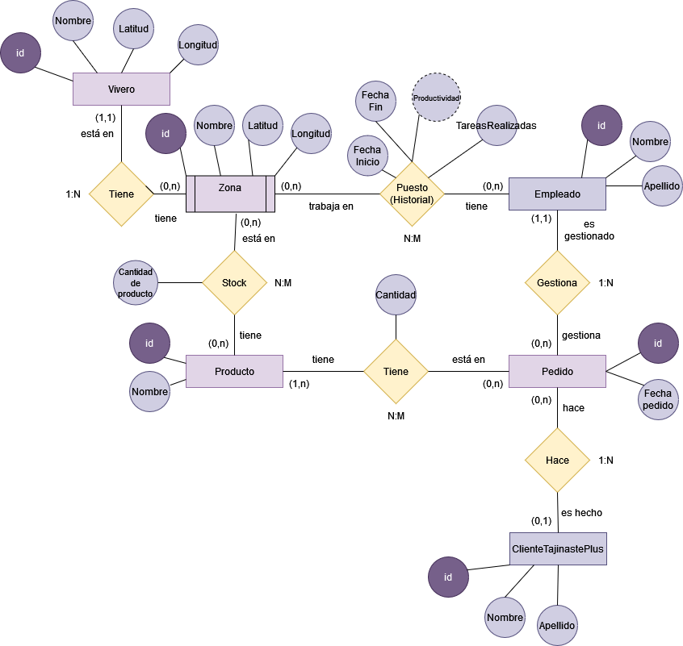

# Modelo Entidad/Relación Viveros



## Entidades Definidas

1. **Vivero**

    **Descripción**: Representa cada uno de los viveros que posee la empresa.

    **Atributos**:
    - `ID_Vivero (PK)`: Identificador único de cada vivero.
    - `Nombre`: Nombre del vivero (ej. "Vivero Norte").
    - `Latitud` y `Longitud`: Coordenadas geográficas para su georreferenciación.
    
    **Ejemplo**:
    ```json
    {
      "ID_Vivero": 1,
      "Nombre": "Vivero Norte",
      "Latitud": 28.1234,
      "Longitud": -15.4321
    }
    ```

2. **Zona** (Entidad débil)

    **Descripción**: Representa las diferentes zonas dentro de un vivero, como almacén, zona exterior, etc. La zona es dependiente del vivero, es decir, no puede existir sin estar asociada a un vivero.

    **Atributos**:
    - `ID_Vivero (FK, PK)`: Identificador único del vivero al que pertenece la zona (parte de la clave primaria).
    - `ID_Zona (PK)`: Identificador de la zona dentro del vivero (parte de la clave primaria).
    - `Nombre`: Nombre de la zona (ej. "Exterior").
    - `Latitud` y `Longitud`: Coordenadas geográficas específicas de la zona dentro del vivero.

    **Ejemplo**:

    ```json
    {
      "ID_Vivero": 1,
      "ID_Zona": 101,
      "Nombre": "Almacén",
      "Latitud": 28.1236,
      "Longitud": -15.4325
    }
    ```

3. **Producto**

    **Descripción**: Productos que se venden en los viveros.

    **Atributos**:
    - `ID_Producto (PK)`: Identificador único del producto.
    - `Nombre`: Nombre del producto (ej. "Maceta grande").

    **Ejemplo**:
    ```json
    {
      "ID_Producto": 2001,
      "Nombre": "Maceta grande"
    }
    ```

4. **Empleado**

    **Descripción**: Representa a los empleados de Tajinaste S.A.

    **Atributos**:
    - `ID_Empleado (PK)`: Identificador único del empleado.
    - `Nombre`: Nombre del empleado (ej. "Juan Pérez").
    **Ejemplo**:
    ```json
    {
      "ID_Empleado": 301,
      "Nombre": "Juan Pérez",
    }
    ```

5. **Cliente**

    **Descripción**: Representa a los clientes de la empresa

    **Atributos**:
    - `ID_Cliente (PK)`: Identificador único del cliente.
    - `Nombre`: Nombre del cliente.
    - `Tajinaste_Plus`: Si es beneficiario del programa Tajinaste Plus. Su valor es Sí o No.
    - `Volumen_de_compras_mensual` y `Volumen_de_compras_desde_Tajinaste_Plus`: El primero se refiere al volumen de compras hechas ese mes y el segundo al volumen total de compras hechas desde la integración en el programa Tajinaste Plus. Los dos atributos son calculados, ya que pueden ser calculados a través de la relación con la entidad Pedido.

    **Ejemplo**:
    ```json
    {
      "ID_Cliente": 5001,
      "Nombre": "Ana González",
      "Tajinaste_Plus": "Sí",
      "Volumen_de_compras_mensual": 30,
      "Volumen_de_compras_desde_Tajinaste_Plus": 45
    }
    ```

6. **Pedido**

    **Descripción**: Representa los pedidos realizados por los clientes, y gestionados por los empleados.

    **Atributos**:
    - `ID_Pedido (PK)`: Identificador único del pedido.
    - `Fecha_Pedido`: Fecha en la que se realizó el pedido.
    **Ejemplo**:
    ```json
    {
      "ID_Pedido": 7001,
      "Fecha_Pedido": "2024-10-01",
    }
    ```

## Relaciones Definidas

### 1. Vivero - Zona
- *Descripción*: Un vivero puede tener múltiples zonas, pero cada zona pertenece a un único vivero.
- *Cardinalidad*: Relación 1:N (Un vivero puede tener varias zonas).
- *Ejemplo*: El Vivero Central (ID_Vivero: 001) tiene las zonas "Zona Exterior" y "Almacén", pero estas zonas solo pertenecen al Vivero Central.

### 2. Zona - Producto (Stock)
- *Descripción*: Una zona puede contener varios productos y un producto puede estar disponible en varias zonas. Se controla la cantidad disponible de cada producto por zona.
- *Cardinalidad*: Relación N:M (Un producto puede estar en varias zonas y una zona puede contener varios productos).
- *Atributos de la relación*:
    - `Stock`: Cada producto tiene una cantidad de stock concreta en cada zona.
- *Ejemplo*: La "Palmera Canariense" (ID_Producto: P001) puede estar en la "Zona Exterior" del Vivero Central con 150 unidades y en el "Almacén" del Vivero Norte con 50 unidades.

### 3. Zona - Empleado (Historial_Puesto)
- *Descripción*: Un empleado solo puede trabajar en una zona a la vez, pero el historial de sus asignaciones se mantiene a lo largo del tiempo.
- *Cardinalidad*: Relación N:M (Una zona puede tener varios empleados, y un empleado trabaja en varias zonas, aunque no a la vez).
- *Atributos de la relación*:
    - `Fecha de Inicio`: Fecha de inicio de trabajo en la zona en cuestión.
    - `Fecha de Fin`: Fecha de fin de trabajo en la zona en cuestión.
    - `Productividad`: Representa la productividad a lo largo del trabajo en la zona en cuestión. Dependerá del tiempo de trabajo y de la tarea.
    - `Tarea`: La tarea que desempeña en la zona en cuestión.
- *Ejemplo*: Juan (ID_Empleado: E001) trabaja en el Vivero Central en la zona alta durante enero a marzo de 2023, cultivando plantas trepadoras con una productividad de 50 puntos.

### 4. Cliente - Pedido
- *Descripción*: Un cliente puede realizar varios pedidos, pero un pedido es realizado por un único cliente.
- *Cardinalidad*: Relación 1:N (Un cliente puede tener múltiples pedidos).
- *Ejemplo*: Ana (ID_Cliente: C001) realizó dos pedidos en marzo y abril de 2023.

### 5. Producto - Pedido
- *Descripción*: Un pedido contiene varios productos, y un producto puede estar incluido en varios pedidos.
- *Cardinalidad*: Relación N:M (Un pedido puede tener varios productos y viceversa).
- *Atributos de la relación*:
    - `Stock`: Cada producto puede ser vendido en varias cantidades
- *Ejemplo*: La "Palmera Canariense" (ID_Producto: P001) fue vendida en varios pedidos en enero y febrero de 2024 en 10 unidades.

### 6. Empleado - Pedido
- *Descripción*: Un empleado puede gestionar varios pedidos, pero cada pedido es gestionado por un único empleado.
- *Cardinalidad*: Relación 1:N (Un empleado puede gestionar varios pedidos).
- *Ejemplo*: Juan (ID_Empleado: E001) gestionó los pedidos de marzo de varios clientes.

## Restricciones Semánticas Definidas

1. *Un empleado no puede trabajar en más de una zona al mismo tiempo*: La relación entre *Empleado* y *Zona* a través de *Historial_Puesto* incluye esta restricción, lo que asegura que un empleado solo esté asignado a una zona en un periodo dado.
   
2. *Un cliente solo puede estar en Tajinaste Plus si supera las 10 compras mensuales*: Solo si un cliente lleva más de 10 compras registradas al mes puede ser accedido al programa de Tajinaste Plus.

3. *El stock de productos no puede ser negativo*: En la relación *Stock* entre *Producto* y *Zona*, la cantidad disponible (Cantidad_Disponible) debe ser mayor o igual a 0.

4. *Cada pedido debe tener un empleado responsable*: Un pedido no puede existir sin que haya un *Empleado* asignado para gestionarlo.